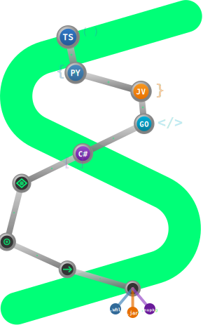

<div align="center">
  
  <h1>Strands Agents — Cross-Language SDK</h1>
  <p><em>One strand of intelligence. Every language it touches.</em></p>

  <p>
    <a href="#quick-start"></a>
    <a href="#languages"></a>
    <a href="https://github.com/aws/jsii"></a>
    <a href="#license"></a>
  </p>
</div>

---

## The Idea

You write an agent in one language. It works beautifully. Then someone asks: *"Can I use this from Java?"*

That question used to mean rewriting everything. Not anymore.

**Strands Agents JSII** takes the [Strands Agents SDK](https://github.com/strands-agents/sdk-python) — the agent loop, the tool system, the model providers, all of it — and makes it callable from **Python, TypeScript, Java, C#, and Go**. One TypeScript source, compiled through [jsii](https://github.com/aws/jsii), with idiomatic sugar for each language so it never feels like a wrapper.

```
            ┌──────────────────────────┐
            │     Your Agent Logic     │
            │   (write it once, here)  │
            └────────────┬─────────────┘
                         │ jsii
         ┌───────┬───────┼───────┬───────┐
         ▼       ▼       ▼       ▼       ▼
       .whl    .npm    .jar   .nupkg    .go
      Python    TS     Java     C#      Go
```

The green strand in the logo isn't decoration. It's the idea: **intelligence flows through a single backbone, branching into every language it touches**. The nodes along the bridge are real — TypeScript at the source, Python, Java, Go, C# along the way, and package artifacts (.whl, .jar, .nupkg) at the output.

---

## Quick Start

```
pip install strands-jsii
```

```python
from strands_jsii import Agent, tool

@tool
def calculator(expression: str) -> str:
    """Evaluate math."""
    return str(eval(expression))

agent = Agent(tools=[calculator])
response = agent("What is 42 * 17?")
```

That's it. Same pattern works in Java, C#, Go, and TypeScript.

<details>
<summary><b>📦 All five languages</b></summary>

#### TypeScript

```typescript
import { Agent, Bedrock, tool } from 'strands-jsii';

const calculator = tool(function calculator({ expression }) {
    return { result: eval(expression) };
}, { description: "Evaluate math" });

const agent = Agent({ tools: [calculator] });
const response = agent("What is 42 * 17?");
```

#### Java

```java
// Strands.* is jsii-native — no "Sugar." prefix needed
var calc = Strands.tool("calculator", "Evaluate math")
    .param("expression", "string", "Math expression")
    .withHandler(handler)
    .create();

var agent = Strands.agentWith(Strands.bedrock(), calc);
agent.ask("What is 42 * 17?");
```

#### Go

```go
calc := NewTool("calculator", "Evaluate math", calcFn, map[string]ParamDef{
    "expression": {Type: "string", Description: "Math expression", Required: true},
})
agent := NewAgent(WithTools(calc))
response := agent.Ask("What is 42 * 17?")
```

#### C#

```csharp
// Strands.* is jsii-native — no "Sugar." prefix needed
var calc = Strands.Tool("calculator", "Evaluate math")
    .Param("expression", "string", "Math expression")
    .WithHandler(handler)
    .Create();

var agent = Strands.AgentWith(Strands.Bedrock(), calc);
agent.Ask("What is 42 * 17?");
```

</details>

---

<a id="languages"></a>

## What Works, Everywhere

| Feature | Python | TypeScript | Go | Java | C# |
|---------|:------:|:----------:|:--:|:----:|:--:|
| **Create agent** | `Agent()` | `Agent()` | `NewAgent()` | `Strands.agent()` | `Strands.Agent()` |
| **Call agent** | `agent("…")` | `agent("…")` | `agent.Ask("…")` | `agent.ask("…")` | `agent.Ask("…")` |
| **Define tools** | `@tool` | `tool(fn)` | `NewTool()` | `Strands.tool().create()` | `Strands.Tool().Create()` |
| **Direct tool call** | `agent.tool.X()` | `agent.tool.X()` | `agent.ToolCall()` | `agent.toolCall()` | `agent.ToolCall()` |
| **Model shorthand** | `Bedrock()` | `Bedrock()` | `BedrockDefault()` | `Strands.bedrock()` | `Strands.Bedrock()` |
| **Wrap any package** | `make_use_tool()` | `make_use_tool()` | — | — | — |
| **Hot-reload tools** | ✅ | ✅ | ✅ | ✅ | ✅ |
| **5 model providers** | ✅ | ✅ | ✅ | ✅ | ✅ |
| **Hooks & callbacks** | ✅ | ✅ | ✅ | ✅ | ✅ |
| **Guardrails** | ✅ | ✅ | ✅ | ✅ | ✅ |
| **Typed errors** | ✅ | ✅ | ✅ | ✅ | ✅ |

---

## Core Concepts

### The Agent Loop

Every Strands agent — regardless of language — runs the same loop:

```
User prompt
    ↓
┌─────────────────────────────┐
│  Model Provider (converse)  │  ← Bedrock / Anthropic / OpenAI / Gemini
└─────────┬───────────────────┘
          ↓
    ┌─ end_turn? ─── YES ──→ Return response
    │
    NO (tool_use)
    ↓
┌─────────────────────────────┐
│  Tool Registry (execute)    │  ← @tool, FunctionTool, hot-reloaded .py files
└─────────┬───────────────────┘
          ↓
    Append toolResult → Loop back to model
```

Model thinks. Tools act. Loop until done. This is the heartbeat.

### Key Classes

| Class | Purpose |
|-------|---------|
| `Agent` / `StrandsAgent` | The agent. Model + tools + conversation + hooks. |
| `Bedrock` / `BedrockModelProvider` | Amazon Bedrock (default provider) |
| `FunctionTool` | Wraps a handler as a tool (cross-language) |
| `ToolRegistry` | Runtime tool storage — add, remove, lookup |
| `ToolWatcher` | Directory watcher — hot-reloads `.py` as tools |
| `AgentTool` | Wraps an agent as a tool (multi-agent patterns) |
| `UniversalToolFactory` | Creates `use_X` tools from any language |
| `ConversationManager` | Message history control (sliding window, summarizing) |
| `CallbackHandler` | Observe agent lifecycle events |
| `HookRegistry` | Intercept and modify agent behavior |
| `GuardrailConfig` | Bedrock Guardrails integration |

---

## Tools

Tools are the agent's hands. Four ways to create them, from simplest to most powerful.

### @tool — The Fast Path (Python)

```python
from strands_jsii import tool

@tool
def shell(command: str) -> str:
    """Execute a shell command."""
    import subprocess
    return subprocess.check_output(command, shell=True, text=True)
```

The decorator reads your function signature, generates JSON Schema, wraps it as a `FunctionTool`. You write a function. It becomes a tool.

### agent.tool.X() — Programmatic Context

```python
agent = Agent(tools=[calculator, weather])

# Pre-fill context (no model call — injects tool results directly)
agent.tool.calculator(expression="6 * 7")
agent.tool.weather(city="Seattle")

# Now the model has context as if it called those tools itself
response = agent("Given the calculations and weather, plan my day.")
```

### make_use_tool() — Any Package is a Tool

```python
from strands_jsii import Agent, make_use_tool

use_boto3  = make_use_tool("boto3", "AWS SDK")
use_pandas = make_use_tool("pandas", "Data analysis")

agent = Agent(tools=[use_boto3, use_pandas])
```

The agent discovers APIs automatically: `__discovery__` → `__describe__` → call. No manual wrapping needed.

### ToolWatcher — Drop a File, Get a Tool

```python
from strands_jsii import Agent, ToolWatcher

watcher = ToolWatcher(agent.tool_registry, directory="./tools")
watcher.start()

# Save tools/greet.py → instantly available as agent.tool.greet()
```

### AgentTool — Agents as Tools

```python
researcher = Agent(system_prompt="You are a research specialist.")
writer = Agent(system_prompt="You are a writing specialist.")

coordinator = Agent(
    tools=[AgentTool("research", "Deep research", researcher),
           AgentTool("write", "Polish content", writer)],
    system_prompt="Coordinate research and writing.",
)
```

### FunctionTool — Cross-Language Native

```typescript
// TypeScript
const tool = new ToolBuilder("greet", "Greet someone")
  .addStringParam("name", "Person's name", true)
  .build(new GreetHandler());
```

```java
// Java
var tool = Sugar.toolOf("greet", "Greet someone",
    params -> "Hello, " + params.get("name"),
    Sugar.param("name", "string", "Person's name", true));
```

---

## Model Providers

5 providers, all normalizing to Bedrock Converse message format internally. Same sugar syntax across all languages.

| Provider | Python | TypeScript | Java | C# |
|----------|--------|------------|------|----|
| **Bedrock** | `Bedrock()` | `Bedrock()` | `Strands.bedrock()` | `Strands.Bedrock()` |
| **Anthropic** | `Anthropic(api_key="…")` | `Anthropic({apiKey:"…"})` | `Strands.anthropic(…)` | `Strands.Anthropic(…)` |
| **OpenAI** | `OpenAI(api_key="…")` | `OpenAI({apiKey:"…"})` | `Strands.openai(…)` | `Strands.Openai(…)` |
| **Gemini** | `Gemini(api_key="…")` | `Gemini({apiKey:"…"})` | `Strands.gemini(…)` | `Strands.Gemini(…)` |
| **Ollama** | `Ollama()` | `Strands.ollama()` | `Strands.ollama()` | `Strands.Ollama()` || **Custom** | Extend `ModelProvider` | Extend `ModelProvider` | Extend `ModelProvider` | Extend `ModelProvider` |

<details>
<summary><b>📦 All five languages</b></summary>

#### Python

```python
from strands_jsii import Agent, Bedrock, Anthropic, OpenAI, Gemini

# Default — Claude on Bedrock, zero config
agent = Agent()

# Bedrock with options
agent = Agent(model=Bedrock(
    model_id="us.anthropic.claude-sonnet-4-20250514-v1:0",
    region="us-east-1",
    max_tokens=8192,
    temperature=0.7,
))

# Anthropic direct
agent = Agent(model=Anthropic(api_key="sk-ant-...", model_id="claude-sonnet-4-20250514"))

# OpenAI
agent = Agent(model=OpenAI(api_key="sk-...", model_id="gpt-4o"))

# Gemini
agent = Agent(model=Gemini(api_key="AIza...", model_id="gemini-2.5-flash"))
```

#### TypeScript

```typescript
const { Agent, Bedrock, Anthropic, OpenAI, Gemini } = require('strands-jsii');

const agent = Agent();  // Bedrock default
const agent = Agent({ model: Bedrock({ modelId: "us.anthropic.claude-sonnet-4-20250514-v1:0" }) });
const agent = Agent({ model: Anthropic({ apiKey: "sk-ant-..." }) });
const agent = Agent({ model: OpenAI({ apiKey: "sk-..." }) });
const agent = Agent({ model: Gemini({ apiKey: "AIza..." }) });
```

#### Go

```go
agent := NewAgent()  // Bedrock default
agent := NewAgent(WithModel(BedrockWithModel("us.anthropic.claude-sonnet-4-20250514-v1:0")))
agent := NewAgent(WithModel(AnthropicProvider("claude-sonnet-4-20250514", "sk-ant-...")))
agent := NewAgent(WithModel(OpenAIProvider("gpt-4o", "sk-...")))
agent := NewAgent(WithModel(GeminiProvider("gemini-2.5-flash", "AIza...")))
```

#### Java

```java
var agent = Strands.agent();                                                   // Default
var agent = Strands.agentWith(Strands.bedrock("us.anthropic.claude-sonnet-4-20250514-v1:0"));
var agent = Strands.agentWith(Strands.anthropic("claude-sonnet-4-20250514", "sk-ant-..."));
var agent = Strands.agentWith(Strands.openai("gpt-4o", "sk-..."));
var agent = Strands.agentWith(Strands.gemini("gemini-2.5-flash", "AIza..."));
```

#### C#

```csharp
var agent = Strands.Agent();                                                   // Default
var agent = Strands.AgentWith(Strands.Bedrock("us.anthropic.claude-sonnet-4-20250514-v1:0"));
var agent = Strands.AgentWith(Strands.Anthropic("claude-sonnet-4-20250514", "sk-ant-..."));
var agent = Strands.AgentWith(Strands.Openai("gpt-4o", "sk-..."));
var agent = Strands.AgentWith(Strands.Gemini("gemini-2.5-flash", "AIza..."));
```

</details>

### With Guardrails

```python
from strands_jsii import Bedrock, GuardrailConfig, Agent

agent = Agent(model=Bedrock(
    guardrail=GuardrailConfig(
        guardrail_id="abc123",
        guardrail_version="1",
        trace="enabled",
    ),
))
```

### Custom Provider

Extend `ModelProvider` in any language — implement `converse()`, return Bedrock Converse format:

```python
from strands_jsii import ModelProvider
import json

class MyProvider(ModelProvider):
    def converse(self, messages_json, system_prompt=None, tool_specs_json=None):
        return json.dumps({
            "output": {"message": {"role": "assistant", "content": [{"text": "Hello!"}]}},
            "stopReason": "end_turn",
            "usage": {"inputTokens": 100, "outputTokens": 50}
        })

    @property
    def model_id(self): return "my-model-v1"

    @property
    def provider_name(self): return "custom"

agent = Agent(model=MyProvider())
```

---

## Conversation Management

```python
from strands_jsii import Agent, SlidingWindowConversationManager

agent = Agent(conversation_manager=SlidingWindowConversationManager(window_size=20))
```

| Manager | Behavior |
|---------|----------|
| `NullConversationManager` | Keep everything (default) |
| `SlidingWindowConversationManager(n)` | Keep first + last N messages |
| `SummarizingConversationManager` | Condense old messages into a text summary |

---

## Hooks & Callbacks

**Observe** with callbacks:

```python
class MyHandler(CallbackHandler):
    def on_tool_start(self, tool_name, input_json):
        print(f"🔧 {tool_name}")
    def on_tool_end(self, tool_name, result_json, duration_ms):
        print(f"✅ {tool_name} ({duration_ms}ms)")

agent = Agent(callback_handler=MyHandler())
```

**Intercept** with hooks:

```python
class SecurityHook(HookProvider):
    def before_invocation(self, event):
        if "DROP TABLE" in event.prompt:
            event.cancelled = True  # Block it

hooks = HookRegistry()
hooks.register(SecurityHook())
agent = Agent(hooks=hooks)
```

---

## Error Handling

| Error | When |
|-------|------|
| `ModelThrottledError` | Rate limited |
| `MaxTokensReachedError` | Hit token generation limit |
| `ContextWindowOverflowError` | Input too large |
| `ToolExecutionError` | Tool raised an exception |
| `MaxCyclesReachedError` | Agent loop exceeded max cycles |
| `GuardrailInterventionError` | Guardrail blocked the request |

```python
from strands_jsii import RetryStrategy

agent = Agent(retry_strategy=RetryStrategy(
    max_retries=3,
    initial_delay=1.0,
    backoff_multiplier=2.0,
))
```

---

## Architecture

```
strands-jsii/
├── src/                          # TypeScript source (the single truth)
│   ├── agent.ts                  #   The agent loop + .ask() + .toolCall()
│   ├── strands.ts                #   Universal factory (Strands.agent/bedrock/tool)
│   ├── models/                   #   Bedrock, Anthropic, OpenAI, Gemini
│   ├── tools/                    #   FunctionTool, ToolBuilder, Registry, Watcher, AgentTool
│   ├── conversation/             #   Sliding window, summarizing
│   ├── hooks/                    #   Callbacks, hooks, lifecycle events
│   ├── errors/                   #   Typed errors, retry strategies
│   └── safety/                   #   Guardrails
├── scripts/
│   ├── patch-python.py           #   Python-only: @tool, __call__, agent.tool.X()
│   ├── patch-typescript.ts       #   JS-only: callable Agent(), Proxy, tool()
│   ├── patch-java-csharp.py      #   Java/C#-only: lambda toolOf(), @ToolMethod
│   ├── patch-go.py               #   Go-only: functional options, NewTool()
│   └── patch-all.py              #   Run all patchers
├── dist/
│   └── python/                   # Generated .whl
└── package.json                  # jsii configuration
```

### How jsii Works

```
TypeScript source
    ↓ npx jsii (compile + validate)
jsii assembly (.jsii)
    ↓ npx jsii-pacmak --targets python
Generated Python/Java/C#/Go bindings
    ↓ patch-python.py
Idiomatic sugar on top
    ↓
Ship it
```

The generated bindings are functional but verbose. The architecture has two layers:

**Layer 1: jsii-native (works in ALL languages, zero patches)**
| Class / Method | What it does |
|---------------|-------------|
| `Strands.agent()` | Create an agent with options |
| `Strands.agentWith(model, ...tools)` | Create agent with model and tools inline |
| `Strands.bedrock()` / `anthropic()` / `openai()` / `gemini()` | Model provider factories |
| `Strands.tool("name", "desc")` | Returns `ToolBuilder` for fluent tool creation |
| `.ask("prompt")` | Universal invoke shorthand on StrandsAgent |
| `.toolCall("name", json)` | Direct tool call returning result JSON |
| `ToolBuilder.param().withHandler().create()` | Fluent tool building |

**Layer 2: Language-specific patches (thin syntactic sugar)**
| Sugar | Language | What it does |
|-------|----------|-------------|
| `Agent(**kw)` | Python | Wraps `StrandsAgent(AgentConfig(...))` |
| `agent("prompt")` | Python, JS | Maps to `agent.invoke("prompt")` via `__call__` / callable |
| `@tool` | Python | Generates `FunctionTool` from function signature |
| `agent.tool.X()` | Python, JS | Proxy that calls tools by attribute/property name |
| `Bedrock(**kw)` | Python, JS | Wraps `BedrockModelProvider(BedrockModelConfig(...))` |
| `tool(fn)` | JS | Function wrapper for FunctionTool |
| `Sugar.toolOf(lambda)` | Java, C# | Lambda-friendly tool creation |
| `@ToolMethod` | Java | Annotation-based tool extraction |
| `NewTool(fn)` | Go | Go function → FunctionTool |
| `NewAgent(WithModel(), WithTools())` | Go | Functional options pattern |

---

## Building from Source

```bash
# Prerequisites: Node.js 20+, Python 3.10+
npm install

# Compile → validate → generate → patch → install
npx jsii
npx jsii-pacmak --targets python
python3 scripts/patch-python.py
pip install dist/python/strands_jsii-0.1.0-py3-none-any.whl

# Verify
python3 -c "from strands_jsii import Agent, tool; print('✅')"
```

Other targets:

```bash
npx jsii-pacmak --targets java      # .jar
npx jsii-pacmak --targets dotnet    # .nupkg
npx jsii-pacmak --targets go        # Go module
```

---

## Design Principles

These aren't aspirations. They're constraints we ship against.

1. **Simplest thing that works.** `Agent()` → `agent("prompt")`. If it takes more than two lines to start, we failed.
2. **Same mental model, native idioms.** Python gets `@tool`. Go gets functional options. Java gets builders. The loop underneath is identical.
3. **Tools are the ecosystem.** `make_use_tool("boto3")` — any installed package becomes an agent tool with zero glue code.
4. **Hot everything.** Reload tools from disk. Swap models. Clear messages. All at runtime, no restart.
5. **One codebase, all languages.** Fix a bug in TypeScript, ship it to five ecosystems.
6. **Errors help you fix things.** Wrong params → show the signature. Missing lib → show the install command. Never just "something went wrong."

---

## Why "JSII"?

[jsii](https://github.com/aws/jsii) is the technology that makes the AWS CDK available in multiple languages from a single TypeScript source. We're using the same approach: write the agent framework once in TypeScript, and jsii generates native bindings for Python, Java, C#, and Go.

The name is the mechanism. The result is freedom — **write agents once, run them in every language your team uses**.

---

<div align="center">
  <sub>Built with <a href="https://github.com/strands-agents">Strands Agents</a> · Powered by <a href="https://github.com/aws/jsii">jsii</a></sub>
</div>

## License

Apache-2.0
