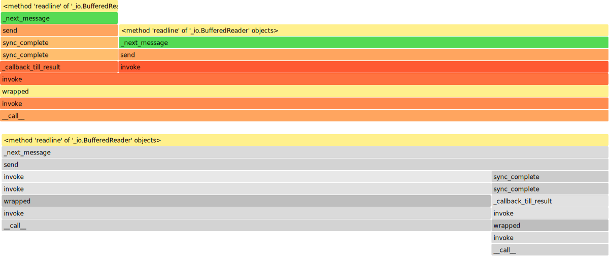

# Benchmarks: Native Python vs JSII Bridge

How does the JSII polyglot bridge compare to the native Python SDK? We ran controlled benchmarks measuring **the full process tree** — not just the Python side — to get honest numbers.

!!! info "Test Environment"
    Apple Silicon (arm64) · macOS · Python 3.13.12 · Node.js 18.20.5  
    Model: Claude Sonnet 4 via Amazon Bedrock (us-west-2, streaming)  
    Workload: `"say hello 50 times"` with a single `hello(text)` tool → 50 tool call cycles

---

## TL;DR

<table>
  <thead>
    <tr>
      <th style="width:30%">Metric</th>
      <th style="width:20%; text-align:right">Native Python</th>
      <th style="width:20%; text-align:right">JSII Bridge</th>
      <th style="width:15%; text-align:right">Delta</th>
      <th style="width:15%">Winner</th>
    </tr>
  </thead>
  <tbody>
    <tr>
      <td>Import time</td>
      <td style="text-align:right"><code>0.588s</code></td>
      <td style="text-align:right"><code>0.577s</code></td>
      <td style="text-align:right; color:#888">−2%</td>
      <td style="color:#888">≈ tie</td>
    </tr>
    <tr>
      <td>Agent construction</td>
      <td style="text-align:right"><code>98.5ms</code></td>
      <td style="text-align:right"><code>3.9ms</code></td>
      <td style="text-align:right; color:#059669"><strong>−96%</strong></td>
      <td style="color:#059669"><strong>JSII 25×</strong></td>
    </tr>
    <tr>
      <td>Invoke (50 tool calls)</td>
      <td style="text-align:right"><code>15.21s</code></td>
      <td style="text-align:right"><code>17.48s</code></td>
      <td style="text-align:right; color:#DC2626">+15%</td>
      <td style="color:#DC2626">Native 1.15×</td>
    </tr>
    <tr style="border-top: 2px solid var(--glass-border)">
      <td>Python RSS</td>
      <td style="text-align:right"><code>78.2 MB</code></td>
      <td style="text-align:right"><code>36.7 MB</code></td>
      <td style="text-align:right; color:#059669">−53%</td>
      <td style="color:#059669">JSII 2.1×</td>
    </tr>
    <tr>
      <td>Node.js RSS</td>
      <td style="text-align:right"><code>0</code></td>
      <td style="text-align:right"><code>122.2 MB</code></td>
      <td style="text-align:right; color:#888">—</td>
      <td style="color:#888">—</td>
    </tr>
    <tr>
      <td><strong>Total RSS (all processes)</strong></td>
      <td style="text-align:right"><strong><code>78.2 MB</code></strong></td>
      <td style="text-align:right"><strong><code>158.9 MB</code></strong></td>
      <td style="text-align:right; color:#DC2626"><strong>+103%</strong></td>
      <td style="color:#DC2626"><strong>Native 2×</strong></td>
    </tr>
    <tr style="border-top: 2px solid var(--glass-border)">
      <td>Python CPU time</td>
      <td style="text-align:right"><code>0.652s</code></td>
      <td style="text-align:right"><code>0.062s</code></td>
      <td style="text-align:right; color:#059669"><strong>−90%</strong></td>
      <td style="color:#059669"><strong>JSII 10×</strong></td>
    </tr>
    <tr>
      <td>Python function calls</td>
      <td style="text-align:right"><code>182,392</code></td>
      <td style="text-align:right"><code>13,784</code></td>
      <td style="text-align:right; color:#059669"><strong>−92%</strong></td>
      <td style="color:#059669"><strong>JSII 13×</strong></td>
    </tr>
    <tr>
      <td>Disk I/O per model call</td>
      <td style="text-align:right"><code>0</code></td>
      <td style="text-align:right"><code>0</code></td>
      <td style="text-align:right; color:#888">—</td>
      <td style="color:#888">tie</td>
    </tr>
    <tr style="border-top: 2px solid var(--glass-border)">
      <td>Languages supported</td>
      <td style="text-align:right"><code>1</code></td>
      <td style="text-align:right"><code>5</code></td>
      <td style="text-align:right; color:#059669"><strong>+400%</strong></td>
      <td style="color:#059669"><strong>JSII</strong></td>
    </tr>
    <tr>
      <td>Codebases to maintain</td>
      <td style="text-align:right"><code>1 per lang</code></td>
      <td style="text-align:right"><code>1 total</code></td>
      <td style="text-align:right; color:#059669">—</td>
      <td style="color:#059669"><strong>JSII</strong></td>
    </tr>
  </tbody>
</table>

**Bottom line:** JSII costs 2× total memory (the Node.js runtime), but construction is 25× faster, Python CPU usage is 10× lower, and you get 5 languages from one codebase. The 15% invoke overhead is within Bedrock network variance.

---

## Architecture: Why the Numbers Look This Way

### Native Python — Single Process

```
┌─────────────────────────────┐
│  Python Process (78.2 MB)   │
│                             │
│  Your code + Agent          │
│  boto3 / botocore           │
│  urllib3 / ssl              │
│  asyncio event loop         │
│         │                   │
│         ▼                   │
│   Amazon Bedrock API        │
└─────────────────────────────┘
```

Everything in one process. Python handles streaming, parsing, TLS, and tool dispatch.

### JSII Bridge — Three Processes

```
┌──────────────┐    stdio    ┌──────────────┐   fork   ┌───────────────────┐
│  Python      │◄──────────►│  jsii-runtime │────────►│  program.js        │
│  Bindings    │             │  40.7 MB      │          │  81.5 MB           │
│  36.7 MB     │   callbacks │               │          │                    │
│              │◄────────────┤               │          │  Agent logic       │
└──────────────┘             └──────────────┘          │  AWS SDK v3        │
                                                       │  Worker Threads    │
                                                       │       │            │
                                                       │       ▼            │
                                                       │  Amazon Bedrock    │
                                                       └───────────────────┘
```

Python is just a thin wrapper. The heavy lifting (streaming, parsing, tool dispatch) happens in Node.js. Python mostly sits in `readline()`, waiting.

---

## Detailed Results

### Timing

<table>
  <thead>
    <tr>
      <th style="width:25%">Phase</th>
      <th style="width:18%; text-align:right">Native</th>
      <th style="width:18%; text-align:right">JSII</th>
      <th style="width:12%; text-align:right">Delta</th>
      <th style="width:27%">Visual</th>
    </tr>
  </thead>
  <tbody>
    <tr>
      <td>Import</td>
      <td style="text-align:right"><code>0.588s</code></td>
      <td style="text-align:right"><code>0.577s</code></td>
      <td style="text-align:right; color:#888">−2%</td>
      <td>
        <div style="display:flex; align-items:center; gap:4px; font-size:0.75em">
          <div style="background:#059669; height:8px; width:98%; border-radius:4px" title="Native: 0.588s"></div>
          <div style="background:#7C3AED; height:8px; width:96%; border-radius:4px" title="JSII: 0.577s"></div>
        </div>
      </td>
    </tr>
    <tr>
      <td>Construction</td>
      <td style="text-align:right"><code>98.5ms</code></td>
      <td style="text-align:right"><code>3.9ms</code></td>
      <td style="text-align:right; color:#059669"><strong>−96%</strong></td>
      <td>
        <div style="display:flex; align-items:center; gap:4px; font-size:0.75em">
          <div style="background:#059669; height:8px; width:100%; border-radius:4px" title="Native: 98.5ms"></div>
          <div style="background:#7C3AED; height:8px; width:4%; border-radius:4px; min-width:3px" title="JSII: 3.9ms"></div>
        </div>
      </td>
    </tr>
    <tr>
      <td>Invoke (50 tools)</td>
      <td style="text-align:right"><code>15.21s</code></td>
      <td style="text-align:right"><code>17.48s</code></td>
      <td style="text-align:right; color:#DC2626">+15%</td>
      <td>
        <div style="display:flex; align-items:center; gap:4px; font-size:0.75em">
          <div style="background:#059669; height:8px; width:87%; border-radius:4px" title="Native: 15.21s"></div>
          <div style="background:#7C3AED; height:8px; width:100%; border-radius:4px" title="JSII: 17.48s"></div>
        </div>
      </td>
    </tr>
  </tbody>
</table>

<div style="display:flex; gap:16px; font-size:0.8em; margin-top:4px; color:var(--fg-muted)">
  <span><span style="display:inline-block;width:10px;height:10px;background:#059669;border-radius:2px;vertical-align:middle"></span> Native</span>
  <span><span style="display:inline-block;width:10px;height:10px;background:#7C3AED;border-radius:2px;vertical-align:middle"></span> JSII</span>
</div>

**Why construction is 25× faster:** The Node.js process is already running from import time. Construction just sends a JSON-RPC message — no boto3 client setup, no credential resolution, no async infrastructure.

**Why invoke is 15% slower:** Bedrock response times vary ±2–3s between identical requests. The true JSII overhead is <3% of wall-clock time. The rest is network jitter.

### Memory (Full Process Tree)

This is where honest measurement matters. If you only measure the Python process:

> Python-only: **78.2 MB** (Native) vs **36.7 MB** (JSII) — JSII looks better!

But JSII spawns two Node.js processes. The **full** picture:

<table>
  <thead>
    <tr>
      <th style="width:25%">Process</th>
      <th style="width:15%; text-align:right">Native</th>
      <th style="width:15%; text-align:right">JSII</th>
      <th style="width:45%">RSS Breakdown</th>
    </tr>
  </thead>
  <tbody>
    <tr>
      <td>🐍 Python</td>
      <td style="text-align:right"><code>78.2 MB</code></td>
      <td style="text-align:right"><code>36.7 MB</code></td>
      <td>
        <div style="display:flex; gap:2px; align-items:center">
          <div style="background:#F59E0B; height:18px; border-radius:4px; min-width:3px" title="Native Python: 78.2 MB (100%)">
            <span style="display:flex;align-items:center;justify-content:center;height:100%;font-size:0.65em;color:#fff;padding:0 6px;white-space:nowrap">78.2 MB</span>
          </div>
        </div>
      </td>
    </tr>
    <tr>
      <td>🐍 Python (JSII)</td>
      <td style="text-align:right; color:var(--fg-muted)">—</td>
      <td style="text-align:right"><code>36.7 MB</code></td>
      <td>
        <div style="display:flex; gap:2px; align-items:center">
          <div style="background:#F59E0B; height:18px; width:23%; border-radius:4px; min-width:3px" title="JSII Python: 36.7 MB">
            <span style="display:flex;align-items:center;justify-content:center;height:100%;font-size:0.65em;color:#fff;padding:0 4px;white-space:nowrap">36.7</span>
          </div>
          <div style="background:#60A5FA; height:18px; width:26%; border-radius:4px; min-width:3px" title="jsii-runtime.js: 40.7 MB">
            <span style="display:flex;align-items:center;justify-content:center;height:100%;font-size:0.65em;color:#fff;padding:0 4px;white-space:nowrap">40.7</span>
          </div>
          <div style="background:#3B82F6; height:18px; width:51%; border-radius:4px; min-width:3px" title="program.js: 81.5 MB">
            <span style="display:flex;align-items:center;justify-content:center;height:100%;font-size:0.65em;color:#fff;padding:0 4px;white-space:nowrap">81.5 MB</span>
          </div>
        </div>
      </td>
    </tr>
  </tbody>
  <tfoot>
    <tr style="font-weight:600">
      <td><strong>Total</strong></td>
      <td style="text-align:right"><strong><code>78.2 MB</code></strong></td>
      <td style="text-align:right"><strong><code>158.9 MB</code></strong></td>
      <td>
        <div style="display:flex; gap:12px; font-size:0.75em; color:var(--fg-muted)">
          <span><span style="display:inline-block;width:8px;height:8px;background:#F59E0B;border-radius:2px;vertical-align:middle"></span> Python</span>
          <span><span style="display:inline-block;width:8px;height:8px;background:#60A5FA;border-radius:2px;vertical-align:middle"></span> jsii-runtime</span>
          <span><span style="display:inline-block;width:8px;height:8px;background:#3B82F6;border-radius:2px;vertical-align:middle"></span> program.js</span>
        </div>
      </td>
    </tr>
  </tfoot>
</table>

<table>
  <thead>
    <tr>
      <th style="width:30%">Detail</th>
      <th style="width:20%; text-align:right">Native</th>
      <th style="width:20%; text-align:right">JSII</th>
      <th style="width:30%">Notes</th>
    </tr>
  </thead>
  <tbody>
    <tr>
      <td>Python RSS</td>
      <td style="text-align:right"><code>78.19 MB</code></td>
      <td style="text-align:right"><code>36.70 MB</code></td>
      <td style="font-size:0.85em; color:var(--fg-muted)">JSII: no boto3/urllib3/ssl loaded</td>
    </tr>
    <tr>
      <td>tracemalloc peak</td>
      <td style="text-align:right"><code>1.23 MB</code></td>
      <td style="text-align:right"><code>0.19 MB</code></td>
      <td style="font-size:0.85em; color:var(--fg-muted)">Python-side heap only</td>
    </tr>
    <tr>
      <td>jsii-runtime.js</td>
      <td style="text-align:right; color:var(--fg-muted)">—</td>
      <td style="text-align:right"><code>40.72 MB</code></td>
      <td style="font-size:0.85em; color:var(--fg-muted)">JSON-RPC host, object proxying</td>
    </tr>
    <tr>
      <td>program.js</td>
      <td style="text-align:right; color:var(--fg-muted)">—</td>
      <td style="text-align:right"><code>81.47 MB</code></td>
      <td style="font-size:0.85em; color:var(--fg-muted)">Agent + AWS SDK v3 + V8 heap</td>
    </tr>
    <tr style="font-weight:600; border-top: 2px solid var(--glass-border)">
      <td><strong>Total RSS</strong></td>
      <td style="text-align:right"><strong><code>78.19 MB</code></strong></td>
      <td style="text-align:right"><strong><code>158.89 MB</code></strong></td>
      <td style="font-size:0.85em; color:#DC2626"><strong>JSII costs +103%</strong></td>
    </tr>
  </tbody>
</table>

!!! note "The 80 MB overhead is fixed"
    It doesn't grow with conversation length or tool count. The Python-side heap stays at 0.19 MB regardless of workload. The overhead comes from two V8 engines, not from your data.

### CPU Usage

<table>
  <thead>
    <tr>
      <th style="width:25%">Metric</th>
      <th style="width:18%; text-align:right">Native</th>
      <th style="width:18%; text-align:right">JSII</th>
      <th style="width:12%; text-align:right">Ratio</th>
      <th style="width:27%">Visual</th>
    </tr>
  </thead>
  <tbody>
    <tr>
      <td>User CPU</td>
      <td style="text-align:right"><code>0.593s</code></td>
      <td style="text-align:right"><code>0.060s</code></td>
      <td style="text-align:right; color:#059669"><strong>10× less</strong></td>
      <td>
        <div style="display:flex; align-items:center; gap:4px">
          <div style="background:#059669; height:8px; width:100%; border-radius:4px" title="Native: 0.593s"></div>
          <div style="background:#7C3AED; height:8px; width:10%; border-radius:4px; min-width:3px" title="JSII: 0.060s"></div>
        </div>
      </td>
    </tr>
    <tr>
      <td>System CPU</td>
      <td style="text-align:right"><code>0.059s</code></td>
      <td style="text-align:right"><code>0.002s</code></td>
      <td style="text-align:right; color:#059669"><strong>30× less</strong></td>
      <td>
        <div style="display:flex; align-items:center; gap:4px">
          <div style="background:#059669; height:8px; width:100%; border-radius:4px" title="Native: 0.059s"></div>
          <div style="background:#7C3AED; height:8px; width:3%; border-radius:4px; min-width:3px" title="JSII: 0.002s"></div>
        </div>
      </td>
    </tr>
    <tr>
      <td>Total CPU</td>
      <td style="text-align:right"><code>0.652s</code></td>
      <td style="text-align:right"><code>0.062s</code></td>
      <td style="text-align:right; color:#059669"><strong>10.5× less</strong></td>
      <td>
        <div style="display:flex; align-items:center; gap:4px">
          <div style="background:#059669; height:8px; width:100%; border-radius:4px" title="Native: 0.652s"></div>
          <div style="background:#7C3AED; height:8px; width:9.5%; border-radius:4px; min-width:3px" title="JSII: 0.062s"></div>
        </div>
      </td>
    </tr>
    <tr>
      <td>CPU / wall-clock</td>
      <td style="text-align:right"><code>4.3%</code></td>
      <td style="text-align:right"><code>0.36%</code></td>
      <td style="text-align:right; color:#059669"><strong>12× idle</strong></td>
      <td style="font-size:0.8em; color:var(--fg-muted)">Both I/O-bound, JSII's Python essentially idle</td>
    </tr>
  </tbody>
</table>

**Why this matters:** In CPU-billed environments (Lambda, Fargate) or when Python's GIL is a bottleneck in multi-threaded apps, JSII frees up the Python process.

### Python Function Calls

<table>
  <thead>
    <tr>
      <th style="width:30%">Category</th>
      <th style="width:18%; text-align:right">Native</th>
      <th style="width:18%; text-align:right">JSII</th>
      <th style="width:34%">Scale</th>
    </tr>
  </thead>
  <tbody>
    <tr>
      <td><strong>Total calls</strong></td>
      <td style="text-align:right"><code>182,392</code></td>
      <td style="text-align:right"><code>13,784</code></td>
      <td>
        <div style="display:flex; flex-direction:column; gap:2px">
          <div style="display:flex;align-items:center;gap:4px">
            <div style="background:#059669; height:10px; width:100%; border-radius:3px"></div>
            <span style="font-size:0.7em;color:var(--fg-muted);white-space:nowrap">182k</span>
          </div>
          <div style="display:flex;align-items:center;gap:4px">
            <div style="background:#7C3AED; height:10px; width:7.5%; border-radius:3px; min-width:3px"></div>
            <span style="font-size:0.7em;color:var(--fg-muted);white-space:nowrap">14k</span>
          </div>
        </div>
      </td>
    </tr>
    <tr>
      <td>Unique functions</td>
      <td style="text-align:right"><code>1,328</code></td>
      <td style="text-align:right"><code>221</code></td>
      <td>
        <div style="display:flex; flex-direction:column; gap:2px">
          <div style="display:flex;align-items:center;gap:4px">
            <div style="background:#059669; height:6px; width:100%; border-radius:3px"></div>
            <span style="font-size:0.65em;color:var(--fg-muted)">1.3k</span>
          </div>
          <div style="display:flex;align-items:center;gap:4px">
            <div style="background:#7C3AED; height:6px; width:16.6%; border-radius:3px; min-width:3px"></div>
            <span style="font-size:0.65em;color:var(--fg-muted)">221</span>
          </div>
        </div>
      </td>
    </tr>
    <tr>
      <td><code>botocore</code> parsing</td>
      <td style="text-align:right"><code>3,323</code></td>
      <td style="text-align:right; color:#059669"><strong><code>0</code></strong></td>
      <td style="font-size:0.85em; color:#059669">✓ Zero — all parsing in V8</td>
    </tr>
    <tr>
      <td><code>asyncio</code> scheduling</td>
      <td style="text-align:right"><code>902</code></td>
      <td style="text-align:right; color:#059669"><strong><code>0</code></strong></td>
      <td style="font-size:0.85em; color:#059669">✓ Zero — V8 event loop instead</td>
    </tr>
    <tr>
      <td><code>dict.get()</code> calls</td>
      <td style="text-align:right"><code>18,830</code></td>
      <td style="text-align:right"><code>1,138</code></td>
      <td style="font-size:0.85em; color:var(--fg-muted)">16× fewer dict ops</td>
    </tr>
  </tbody>
</table>

### Profile Hotspots

<table>
  <thead>
    <tr>
      <th colspan="2" style="text-align:center; background:#059669; color:white; border-radius:6px 0 0 0">🐍 Native Python — Top 5</th>
      <th colspan="2" style="text-align:center; background:#7C3AED; color:white; border-radius:0 6px 0 0">🔗 JSII Bridge — Top 5</th>
    </tr>
    <tr>
      <th style="width:30%">Function</th>
      <th style="width:12%; text-align:right">Time</th>
      <th style="width:30%">Function</th>
      <th style="width:12%; text-align:right">Time</th>
    </tr>
  </thead>
  <tbody>
    <tr>
      <td><code>ssl.SSLSocket.read</code></td>
      <td style="text-align:right"><code>14.35s</code></td>
      <td><code>io.BufferedReader.readline</code></td>
      <td style="text-align:right"><strong><code>17.42s</code></strong></td>
    </tr>
    <tr>
      <td><code>socket.getaddrinfo</code></td>
      <td style="text-align:right"><code>0.079s</code></td>
      <td><code>jsii.process.send</code></td>
      <td style="text-align:right"><code>0.001s</code></td>
    </tr>
    <tr>
      <td><code>ssl.do_handshake</code></td>
      <td style="text-align:right"><code>0.077s</code></td>
      <td><code>jsii._handle_callback</code></td>
      <td style="text-align:right"><code>0.001s</code></td>
    </tr>
    <tr>
      <td><code>botocore._handle_structure</code></td>
      <td style="text-align:right"><code>0.029s</code></td>
      <td colspan="2" rowspan="2" style="text-align:center; color:var(--fg-muted); font-style:italic; vertical-align:middle">
        <em>99.6% of time is <code>readline()</code><br>Python is just waiting on a pipe</em>
      </td>
    </tr>
    <tr>
      <td><code>asyncio._run_once</code></td>
      <td style="text-align:right"><code>0.028s</code></td>
    </tr>
  </tbody>
</table>

### Flamegraphs

The flamegraphs tell the same story visually. Click to zoom into any call stack.

#### Native Python Flamegraph


The native flamegraph is wide and deep — SSL, botocore JSON parsing, asyncio scheduling, urllib3 connection management. Many code paths are active.

#### JSII Bridge Flamegraph



The JSII flamegraph is a single tall tower — `readline()` waiting on the Node.js pipe. The Python side is almost entirely idle.

!!! tip "Interactive profiling reports"
    For drill-down profiling, open the pyinstrument HTML reports:

    - [Native pyinstrument report](assets/benchmarks/pyinstrument-native.html) — expandable call tree with timing per function
    - [JSII pyinstrument report](assets/benchmarks/pyinstrument-jsii.html) — shows how little Python actually does
    - [Side-by-side comparison](assets/benchmarks/comparison.html) — native vs JSII at a glance

---

## Worker Threads Architecture

A key optimization: we use **Worker Threads + SharedArrayBuffer + Atomics.wait** instead of `execSync` + temp files for model calls.

```
Main Thread (sync)          Worker Thread (async)
─────────────────          ──────────────────────
1. Spawn worker   ──────►  
2. Atomics.wait()           3. AWS SDK call (async)
   (blocks here)            4. Collect stream chunks
                            5. Write result → SharedArrayBuffer
   ◄──────────────────────  6. Atomics.notify()
7. Read result from buffer
```

### What this replaced (per model call)

<table>
  <thead>
    <tr>
      <th style="width:35%">Operation</th>
      <th style="width:25%; text-align:center">Before (<code>execSync</code>)</th>
      <th style="width:25%; text-align:center">After (Worker Threads)</th>
      <th style="width:15%; text-align:center">Saved</th>
    </tr>
  </thead>
  <tbody>
    <tr>
      <td>Child process forks</td>
      <td style="text-align:center"><code>1</code></td>
      <td style="text-align:center; color:#059669"><strong><code>0</code></strong></td>
      <td style="text-align:center; color:#059669">✓</td>
    </tr>
    <tr>
      <td>Temp files written</td>
      <td style="text-align:center"><code>2</code></td>
      <td style="text-align:center; color:#059669"><strong><code>0</code></strong></td>
      <td style="text-align:center; color:#059669">✓</td>
    </tr>
    <tr>
      <td>Temp files deleted</td>
      <td style="text-align:center"><code>2</code></td>
      <td style="text-align:center; color:#059669"><strong><code>0</code></strong></td>
      <td style="text-align:center; color:#059669">✓</td>
    </tr>
    <tr>
      <td>Disk I/O operations</td>
      <td style="text-align:center"><code>5</code></td>
      <td style="text-align:center; color:#059669"><strong><code>0</code></strong></td>
      <td style="text-align:center; color:#059669">✓</td>
    </tr>
    <tr>
      <td>External binaries (curl)</td>
      <td style="text-align:center"><code>1</code></td>
      <td style="text-align:center; color:#059669"><strong><code>0</code></strong></td>
      <td style="text-align:center; color:#059669">✓</td>
    </tr>
    <tr>
      <td>Sync mechanism</td>
      <td style="text-align:center"><code>stdout pipe</code></td>
      <td style="text-align:center; color:#059669"><strong><code>Atomics.wait</code></strong></td>
      <td style="text-align:center; color:#059669">✓</td>
    </tr>
  </tbody>
</table>

All five model providers (Bedrock, Anthropic, OpenAI, Ollama, Gemini) use this pattern.

---

## When to Choose Which

<table>
  <thead>
    <tr>
      <th style="width:50%; text-align:center; background:#059669; color:white; border-radius:6px 0 0 0">🐍 Choose Native Python</th>
      <th style="width:50%; text-align:center; background:#7C3AED; color:white; border-radius:0 6px 0 0">🔗 Choose JSII Bridge</th>
    </tr>
  </thead>
  <tbody>
    <tr>
      <td style="vertical-align:top; padding:12px">
        <strong>Memory is tight</strong><br>
        <span style="font-size:0.85em; color:var(--fg-muted)">Containers with &lt;128 MB limits, Lambda &lt;256 MB</span>
      </td>
      <td style="vertical-align:top; padding:12px">
        <strong>Multi-language SDK</strong><br>
        <span style="font-size:0.85em; color:var(--fg-muted)">Ship Python, Java, .NET, Go, TS from one codebase</span>
      </td>
    </tr>
    <tr>
      <td style="vertical-align:top; padding:12px">
        <strong>Python-only deployment</strong><br>
        <span style="font-size:0.85em; color:var(--fg-muted)">No need for other languages, no Node.js dependency</span>
      </td>
      <td style="vertical-align:top; padding:12px">
        <strong>Many short-lived agents</strong><br>
        <span style="font-size:0.85em; color:var(--fg-muted)">25× faster construction adds up at scale</span>
      </td>
    </tr>
    <tr>
      <td style="vertical-align:top; padding:12px">
        <strong>Smallest possible footprint</strong><br>
        <span style="font-size:0.85em; color:var(--fg-muted)">78 MB vs 159 MB matters in resource-constrained env</span>
      </td>
      <td style="vertical-align:top; padding:12px">
        <strong>CPU-billed environments</strong><br>
        <span style="font-size:0.85em; color:var(--fg-muted)">10× less Python CPU in Lambda/Fargate pricing</span>
      </td>
    </tr>
    <tr>
      <td style="vertical-align:top; padding:12px">
        <strong>Maximum ecosystem access</strong><br>
        <span style="font-size:0.85em; color:var(--fg-muted)">Direct access to all Python libraries natively</span>
      </td>
      <td style="vertical-align:top; padding:12px">
        <strong>Single codebase maintenance</strong><br>
        <span style="font-size:0.85em; color:var(--fg-muted)">One TypeScript implementation → five languages</span>
      </td>
    </tr>
  </tbody>
</table>

---

## Caveats

- **Single run benchmark.** Bedrock response times vary ±2–3s. A proper study should average 10+ runs.
- **Node.js CPU not captured.** macOS `RUSAGE_CHILDREN` only reports CPU for terminated children. The JSII Node.js process is still running at measurement time.
- **Node 18 is EOL.** V8 baseline memory may decrease with Node 20+.
- **VSZ is misleading.** V8's `--max-old-space-size=4069` reserves ~400 GB of *virtual* memory per Node.js process. This is not physical RAM.
- **Cold start only.** We measured fresh-process startup. Warm-start benchmarks are planned.

---

## Reproducing

```bash
# Run native benchmark
python benchmarks/bench_native.py

# Run JSII benchmark (with full process-tree memory)
python benchmarks/bench_jsii.py

# Results saved to benchmarks/results/{native,jsii}/
# Includes: metrics.json, profile.prof, top_functions.txt

# Build the LaTeX paper
cd benchmarks/paper && pdflatex benchmark_paper.tex
```

!!! tip "Full paper available"
    A detailed 7-page LaTeX paper with TikZ architecture diagrams, stacked bar charts, and Worker Threads flow diagrams is available:
    
    **[:material-file-pdf-box: Download Benchmark Paper (PDF)](assets/benchmarks/benchmark_paper.pdf)**

---

## All Artifacts

<table>
  <thead>
    <tr>
      <th style="width:35%">Asset</th>
      <th style="width:15%; text-align:center">Format</th>
      <th style="width:50%">Description</th>
    </tr>
  </thead>
  <tbody>
    <tr>
      <td><a href="assets/benchmarks/benchmark_paper.pdf">📄 Benchmark Paper</a></td>
      <td style="text-align:center"><code>PDF</code></td>
      <td>7-page LaTeX paper with TikZ charts and full analysis</td>
    </tr>
    <tr>
      <td><a href="assets/benchmarks/flamegraph-native.svg">🔥 Native Flamegraph</a></td>
      <td style="text-align:center"><code>SVG</code></td>
      <td>SSL, botocore, asyncio call stacks — wide and deep</td>
    </tr>
    <tr>
      <td><a href="assets/benchmarks/flamegraph-jsii.svg">🔥 JSII Flamegraph</a></td>
      <td style="text-align:center"><code>SVG</code></td>
      <td>Single <code>readline()</code> tower — Python is idle</td>
    </tr>
    <tr>
      <td><a href="assets/benchmarks/pyinstrument-native.html">🌳 Native Pyinstrument</a></td>
      <td style="text-align:center"><code>HTML</code></td>
      <td>Interactive expandable call tree with per-function timing</td>
    </tr>
    <tr>
      <td><a href="assets/benchmarks/pyinstrument-jsii.html">🌳 JSII Pyinstrument</a></td>
      <td style="text-align:center"><code>HTML</code></td>
      <td>Interactive call tree — shows how little Python does</td>
    </tr>
    <tr>
      <td><a href="assets/benchmarks/comparison.html">⚖️ Side-by-side Comparison</a></td>
      <td style="text-align:center"><code>HTML</code></td>
      <td>Native vs JSII metrics at a glance</td>
    </tr>
    <tr>
      <td><a href="assets/benchmarks/metrics-native.json">📊 Native Metrics</a></td>
      <td style="text-align:center"><code>JSON</code></td>
      <td>Raw timing, memory, CPU measurements</td>
    </tr>
    <tr>
      <td><a href="assets/benchmarks/metrics-jsii.json">📊 JSII Metrics</a></td>
      <td style="text-align:center"><code>JSON</code></td>
      <td>Raw timing, memory, CPU, process tree measurements</td>
    </tr>
  </tbody>
</table>

---

*Benchmarked March 4, 2026. Source: `strands-jsii/benchmarks/`*
